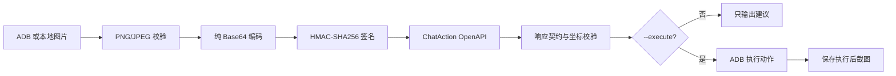

# ChatAction OpenAPI + ADB Demo

该示例演示 Mobile Use Agent `ChatAction` 接口的单步闭环：获取 Android
截图、调用火山引擎 OpenAPI 获取下一步 UI 动作、校验返回参数，并按需通过
ADB 执行动作。

> 默认只输出动作建议。只有显式添加 `--execute` 才会操作设备。

## 能力范围

- 调用 `ipaas / ChatAction / 2023-08-01`
- 输入自然语言目标和 PNG/JPEG 截图
- 支持 `tap`、`swipe`、`longPress`、`type`、`none`
- 将模型坐标映射到截图真实像素
- 校验动作枚举、必填参数、坐标边界和持续时间
- 可从 ADB 实时截图，也可分析本地图片
- 保存脱敏报告和执行前后截图
- 兼容两种已知响应结构：
  - `Result.run_id / action / params`
  - `Result.RunId / ThreadId / data.{RunId, action, params}`

## 工作流程



## 环境要求

- Python 3.12+
- Android Platform Tools（`adb`）
- 可访问 `open.volcengineapi.com`
- 已开通 Mobile Use Agent OpenAPI 权限
- 如设备需要认证：可用的 ADB 私钥

安装 Python 依赖：

```bash
python3 -m pip install -r requirements.txt
```

## 凭证配置

AK/SK 只通过环境变量传入。不要写入源码、README、命令历史或 `.env` 并提交。

```bash
export VOLC_ACCESSKEY="YOUR_ACCESS_KEY"
export VOLC_SECRETKEY="YOUR_SECRET_KEY"
```

ADB 参数也可以使用环境变量：

```bash
export ADB_SERIAL="HOST:PORT"
export ADB_VENDOR_KEYS="/path/to/adb_private_key"
```

## 快速开始

### 1. 仅获取建议

```bash
python3 chat_action_demo.py \
  --serial "HOST:PORT" \
  --adb-key "/path/to/adb_private_key" \
  --home \
  --prompt "点击设置图标"
```

输出示例：

```json
{
  "result": {
    "action": "tap",
    "params": {"x": 540, "y": 518},
    "executed": false
  }
}
```

### 2. 执行一个动作

确认截图和 Prompt 不会触发高风险操作后，再添加 `--execute`：

```bash
python3 chat_action_demo.py \
  --serial "HOST:PORT" \
  --adb-key "/path/to/adb_private_key" \
  --home \
  --prompt "点击设置图标" \
  --execute
```

### 3. 分析本地图片

```bash
python3 chat_action_demo.py \
  --image ./screen.png \
  --prompt "向下滑动查看更多内容"
```

## 输出文件

每次运行默认在 `artifacts/<timestamp>/` 生成：

| 文件 | 说明 |
|---|---|
| `before.png` / `before.jpg` | 接口输入截图 |
| `after.png` | 实际执行后的截图；仅动作执行成功时生成 |
| `provider_response.json` | 服务端响应，不含请求图片和凭证 |
| `report.json` | 脱敏执行摘要 |

`artifacts/` 已加入 `.gitignore`。

## 多步骤任务

`ChatAction` 每次只返回一个动作。安装应用等任务需要循环执行以下步骤：

1. 截取当前屏幕。
2. 使用完整任务目标调用 `ChatAction`。
3. 校验并执行单个动作。
4. 使用确定性信号检查是否完成，例如 `pm path <package>`。
5. 未完成则返回步骤 1；遇到付费、登录、协议或高风险授权时停止并人工确认。

实测的应用安装任务包含打开应用商店、处理首次启动页面、搜索、下载、系统安装
确认和包管理器验收。模型动作必须配合确定性后置校验，不能只以页面文案判断成功。

## 安全设计

| 风险 | 处理 |
|---|---|
| AK/SK 泄露 | 只读环境变量；不接受 CLI 凭证参数；不写入报告 |
| ADB 私钥泄露 | 只接收文件路径；不复制密钥；常见密钥名已加入 `.gitignore` |
| 越界或残缺坐标 | 执行前按截图尺寸校验 |
| ADB shell 注入 | `type` 仅允许 1-256 个安全 ASCII 字符 |
| 模型误操作 | 默认不执行；`--execute` 显式开启；复杂任务需业务后置校验 |
| TLS 中间人 | 始终校验证书；优先使用 `certifi`，不支持关闭校验 |
| 图片过大 | 调用前限制为 5 MiB |

发布或提交代码前建议执行：

```bash
git grep -n -E 'VOLC_ACCESSKEY=|VOLC_SECRETKEY=|Authorization:|ImageBase64' -- .
git status --short
```

以上扫描命中示例代码中的字段名并不等于泄露；需要人工确认不存在真实值。

## 测试

```bash
python3 -m unittest -v
python3 -m py_compile chat_action_demo.py test_chat_action_demo.py
```

测试覆盖签名、查询编码、Base64 格式、两种响应结构、OpenAPI 错误透传、坐标
边界、五类动作映射和文本注入防护。测试使用虚构凭证，不访问真实服务或设备。

## 已知限制

- ADB `input text` 对中文和部分输入法兼容性有限，因此自动执行文本仅开放安全 ASCII。
- `none` 既可能表示无需操作，也可能表示模型无法判断；复杂任务不能据此直接判定成功。
- 坐标合法不代表业务动作正确。生产系统应增加应用包名、Activity、状态机、权限和副作用检查。
- 该示例用于接口演示，不包含并发控制、持久化任务编排、SLA、审计平台或计费能力。

## 参考

- [Mobile Use Agent OpenAPI](https://www.volcengine.com/docs/6394/1953040?lang=zh)
- [vePhone MobileUse Quick Start](../readme.md)
